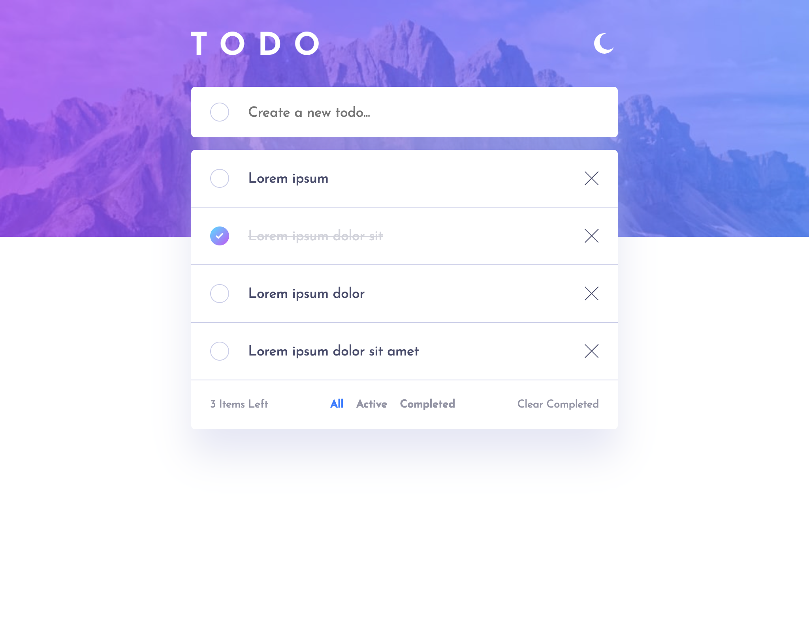
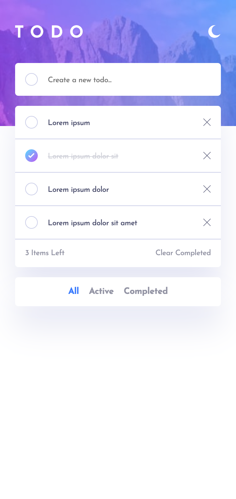
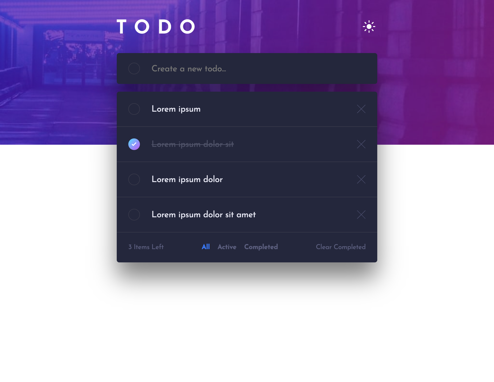
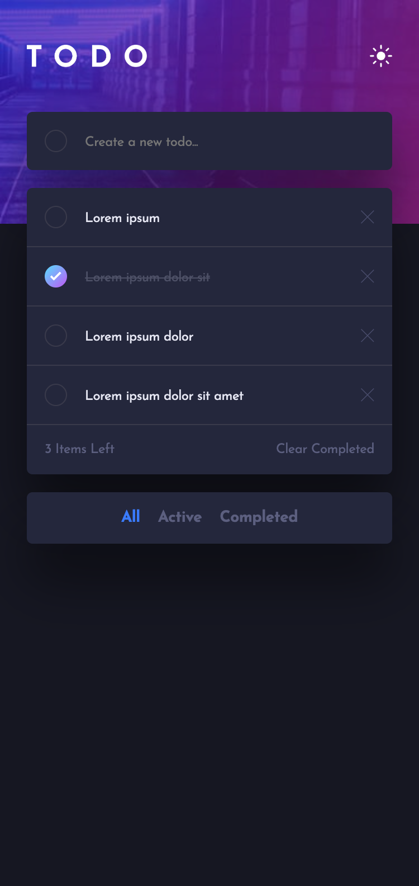

# Todo List App With React

## Overview

Thanks for checking out this front-end coding challenge.

This project is a robust task management application designed to help users organize their daily activities. It features a clean, responsive interface with theme toggling and data persistence, allowing users to efficiently track their progress across different sessions.

[Live Demo](https://emretantu.github.io/todo-list-react)

## Table of Contents
- [Project source](#project-source)
- [The challenge](#the-challenge)
- [Screenshot](#screenshot)
- [Links](#links)
- [Built with (tech-stack)](#built-with-tech-stack)
- [What you need to know](#what-you-need-to-know)
- [Author](#author)

## Project source

This project is a solution to the [Todo App challenge](https://www.frontendmentor.io/challenges/todo-app-Su1_KokOW) on Frontend Mentor. 

## The challenge

Users should be able to:

- View the optimal layout for the app depending on their device's screen size
- See hover states for all interactive elements on the page
- Add new todos to the list
- Mark todos as complete
- Delete todos from the list
- Filter by all/active/complete todos
- Clear all completed todos
- Toggle between light and dark modes (defaults to the user's system preference on first load)
- Persist both todo list data and theme preferences in `localStorage`
- Handle edge cases:
  - Prevent layout issues when users enter very long text.
  - Prevent adding empty entries.
  - Automatically trim leading/trailing whitespace from input.
- **Bonus**: Drag and drop to reorder items on the list

## Screenshot

 

 

## Links

- [Live Demo](https://emretantu.github.io/todo-list-react)
- [Frontend Mentor Challange](https://www.frontendmentor.io/challenges/todo-app-Su1_KokOW)
- [DND Kit](https://dndkit.com/)

## Built with (tech stack)

- HTML
- CSS
- React
- React DnD Kit (for drag-and-drop functionality)

## What You Need to Know

- Proficiency with the tech stack listed above.
- I utilized the **React Context API** and custom hooks to manage global state for theme switching.
- Custom hooks were also implemented to handle `localStorage` synchronization and specific responsive design logic.

## Author

**Emre Tantu**
- Website - [emretantu.dev](https://www.emretantu.dev)
- Contact - [hello@emretantu.dev](mailto:hello@emretantu.dev)
- LinkedIn - [in/emretantu](https://www.linkedin.com/in/emretantu/)
- Twitter - [@emretantu](https://www.twitter.com/emretantu)

---
---

# 🇹🇷 Yapılacaklar Listesi (Todo List) — React İle

## Genel Bakış

Bu front-end kodlama projesine göz attığınız için teşekkürler.

Bu proje, kullanıcıların günlük aktivitelerini organize etmelerine yardımcı olmak için tasarlanmış sağlam bir görev yönetim uygulamasıdır. Farklı oturumlar arasında ilerlemeyi takip etmeye olanak tanıyan tema değiştirme ve veri kalıcılığı (data persistence) özelliklerine sahip, temiz ve duyarlı (responsive) bir arayüz sunar.

[Canlı Demo](https://emretantu.github.io/todo-list-react)

## İçindekiler
- [Proje kaynağı](#proje-kaynagi)
- [İsterler (Gereksinimler)](#isterler-gereksinimler)
- [Ekran Görüntüleri](#ekran-goruntuleri)
- [Linkler](#linkler)
- [Kullanılan Teknolojiler](#kullanilan-teknolojiler)
- [Bilmeniz Gerekenler](#bilmeniz-gerekenler)
- [Geliştirici](#gelistirici)

## Proje kaynağı

Bu proje, Frontend Mentor üzerindeki [Todo App challenge](https://www.frontendmentor.io/challenges/todo-app-Su1_KokOW)'ın  bir çözümüdür.

## İsterler (Gereksinimler)

Kullanıcılar şunları yapabilmelidir:

- Cihazlarının ekran boyutuna göre uygulama için en uygun düzeni görüntüleyebilme (responsive design)
- Sayfadaki tüm etkileşimli öğeler için üzerine gelme (hover) durumlarını görebilme
- Listeye yeni yapılacaklar (todo) ekleyebilme
- Yapılacakları tamamlandı olarak işaretleyebilme
- Yapılacakları listeden silebilme
- Tümü/aktif/tamamlanmış yapılacaklara göre filtreleme yapabilme
- Tamamlanan tüm yapılacakları temizleyebilme
- Aydınlık ve karanlık mod arasında geçiş yapabilme (ilk yüklemede kullanıcının sistem tercihi varsayılan olarak kabul edilir)
- Hem yapılacaklar listesi verilerini hem de tema tercihlerini `localStorage` üzerinde saklayabilme
- Uç durumları (edge cases) ele alma:
  - Kullanıcılar çok uzun metin girdiğinde düzen sorunlarını önleme.
  - Boş girişler eklenmesini önleme.
  - Girdinin başındaki/sonundaki boşlukları otomatik olarak kırpma (trim).
- **Bonus**: Listedeki öğeleri yeniden sıralamak için sürükle ve bırak (drag and drop) özelliği

## Ekran Görüntüleri

 

 

## Linkler

- [Canlı Demo](https://emretantu.github.io/todo-list-react)
- [Frontend Mentor Challenge](https://www.frontendmentor.io/challenges/todo-app-Su1_KokOW)
- [DND Kit](https://dndkit.com/)

## Kullanılan Teknolojiler

- HTML
- CSS
- React
- React DnD Kit (sürükle ve bırak işlevselliği için)

## Bilmeniz Gerekenler

- Yukarıda listelenen teknoloji yığınına hakimiyet.
- Tema değişimi için global state yönetiminde **React Context API** ve custom hook'lar kullandım.
- `localStorage` senkronizasyonu ve belirli responsive tasarım mantıkları için de ayrıca custom hook'lar uyguladım.

## Geliştirici

**Emre Tantu**
- Website - [emretantu.dev](https://www.emretantu.dev)
- İletişim - [hello@emretantu.dev](mailto:hello@emretantu.dev)
- LinkedIn - [in/emretantu](https://www.linkedin.com/in/emretantu/)
- Twitter - [@emretantu](https://www.twitter.com/emretantu)